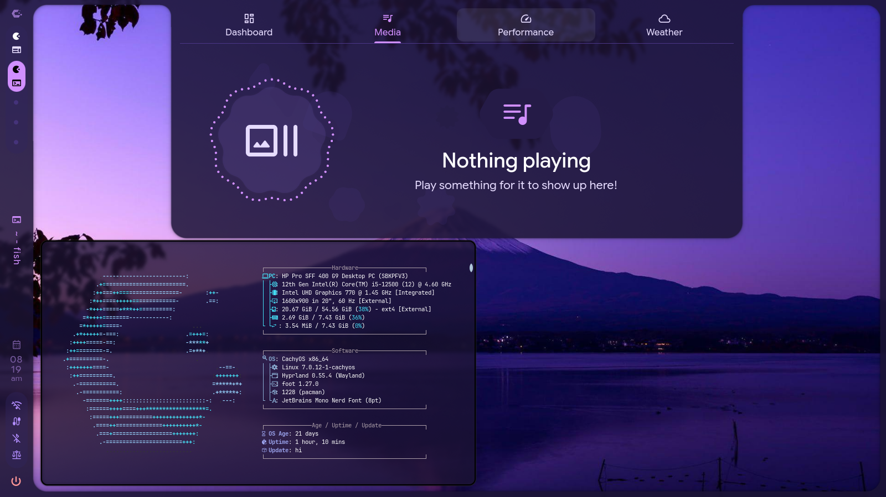

# 🌌 Caelestia Schemes

IDK

---

## 🎨 Available Themes

| Preview | Theme Name | Description | Key Accents |
| :---: | :--- | :--- | :--- |
|  | **Dasli** | The vibrant, signature look of Windows 11. | Deep Blues and Black |
|  | **BlackArch** | An aggressive, high-contrast dark theme optimized for stealth setups. | Pitch Black & Glowing Red |
|  | **DarkMono** | A clean, minimalist aesthetic stripped of all color distractions. | Monochromatic Grays & White |
|  | **Reze** | :P Placeholder | Purple |

### Prerequisites
Get Caelestia shell if you haven't already [`fish`]https://github.com/caelestia-dots/shell
Make sure you have the [`fish`](https://github.com/fish-shell/fish-shell) shell installed before running the automated setup.

```sh
# Clone the repository to the recommended directory
git clone https://github.com/LuckyToShine/Dasli-theme.git ~

# Navigate to the directory
cd ~/Dasli-theme

# Installation
sudo mv Dasli

The install script has some options for installing configs for some apps.
