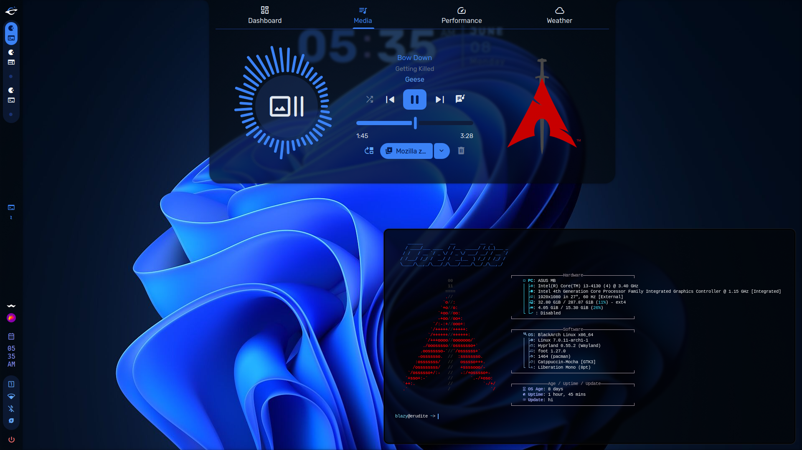
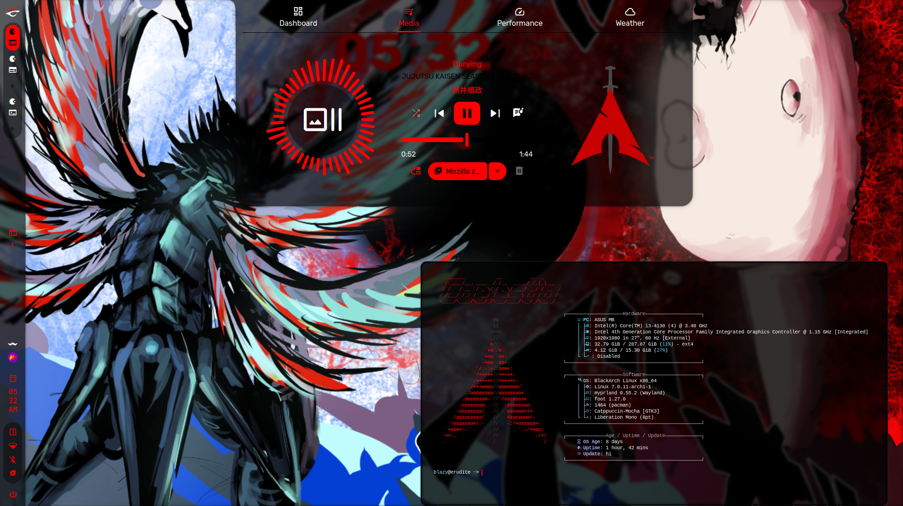
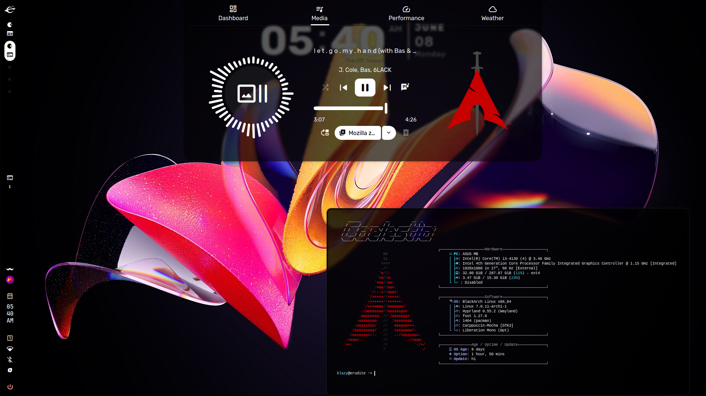

# 🌌 Caelestia Schemes

A curated collection of custom color schemes and configurations for the **Caelestia** desktop environment. These themes completely overhaul your UI components—including dashboards, media players, weather widgets, and terminal emulators—to deliver cohesive visual experiences ranging from deep space aesthetics to high-contrast monochrome.

---

## 🎨 Available Themes

| Preview | Theme Name | Description | Key Accents |
| :---: | :--- | :--- | :--- |
|  | **Dasli** | The vibrant, signature look of Caelestia. | Warm Purples & Pinks |
|  | **BlackArch** | An aggressive, high-contrast dark theme optimized for stealth setups. | Pitch Black & Glowing Red |
|  | **DarkMono** | A clean, minimalist aesthetic stripped of all color distractions. | Monochromatic Grays & White |

---

## 🚀 Installation & Setup

> [!WARNING]
> The installation script uses **symlinks**. Moving or deleting the repository folder after installation will break your application configurations (e.g., Hyprland may fail to start). 
> 
> **Recommended Path:** Clone this repository directly to `~/.local/share/caelestia`.

### Prerequisites
Make sure you have the [`fish`](https://github.com/fish-shell/fish-shell) shell installed before running the automated setup.

```sh
# Clone the repository to the recommended directory
git clone [https://github.com/LuckyToShine/Dasli-theme.git](https://github.com/LuckyToShine/Dasli-theme.git) ~/.local/share/caelestia

# Navigate to the directory
cd ~/.local/share/caelestia

## Installation

Simply clone this repo and run the install script (you need
[`fish`](https://github.com/fish-shell/fish-shell) installed).

> [!WARNING]
> The install script symlinks all configs into place, so you CANNOT
> move/remove the repo folder once you run the install script. If
> you do, most apps will not behave properly and some (e.g. Hyprland)
> will fail to start completely. I recommend cloning the repo to
> `~/.local/share/caelestia`.

The install script has some options for installing configs for some apps.

```
$ ./install.fish -h
usage: ./install.sh [-h] [--noconfirm] [--spotify] [--vscode] [--discord] [--aur-helper]

options:
  -h, --help                  show this help message and exit
  --noconfirm                 do not confirm package installation
  --spotify                   install Spotify (Spicetify)
  --vscode=[codium|code]      install VSCodium (or VSCode)
  --discord                   install Discord (OpenAsar + Equicord)
  --zen                       install Zen browser
  --aur-helper=[yay|paru]     the AUR helper to use
```

For example:

```sh
git clone https://github.com/LuckyToShine/Dasli-theme.git
```

### Manual installation

Dependencies:

-   hyprland
-   xdg-desktop-portal-hyprland
-   xdg-desktop-portal-gtk
-   hyprpicker
-   wl-clipboard
-   cliphist
-   inotify-tools
-   app2unit
-   wireplumber
-   trash-cli
-   foot
-   fish
-   fastfetch
-   starship
-   btop
-   jq
-   eza
-   adw-gtk-theme
-   papirus-icon-theme
-   qtengine-git
-   ttf-jetbrains-mono-nerd

#### Installing Spicetify configs:

Follow the Spicetify [installation instructions](https://spicetify.app/docs/advanced-usage/installation),
copy or symlink the `spicetify` folder to `$XDG_CONFIG_HOME/spicetify` and run

```sh
spicetify config current_theme caelestia color_scheme caelestia custom_apps marketplace
spicetify apply
```

#### Installing VSCode/VSCodium configs:

Install VSCode or VSCodium, then copy or symlink `vscode/settings.json` and
`vscode/keybindings.json` into the `$XDG_CONFIG_HOME/Code/User` (or `$XDG_CONFIG_HOME/VSCodium/User`
if using VSCodium) folder. Then copy or symlink `vscode/flags.conf` to `$XDG_CONFIG_HOME/code-flags.conf`
(or `$XDG_CONFIG_HOME/codium-flags.conf` if using VSCodium).

Finally, install the extension VSIX from `vscode/caelestia-vscode-integration`.

```sh
# Use `codium` if using VSCodium
code --install-extension vscode/caelestia-vscode-integration/caelestia-vscode-integration-*.vsix
```

#### Installing Zen Browser configs:

Install Zen Browser, then copy or symlink `zen/userChrome.css` to the `chrome` folder in your
profile of choice in `~/.zen`. e.g. `zen/userChrome.css -> ~/.zen/<profile>/chrome/userChrome.css`.

Now install the native app by copying `zen/native_app/manifest.json` to
`~/.mozilla/native-messaging-hosts/caelestiafox.json` and replacing the `{{ $lib }}` string in it
with the absolute path of `~/.local/lib/caelestia` (this must be the absolute path, e.g.
`/home/user/.local/lib/caelestia`). Then copy or symlink `zen/native_app/app.fish` to
`~/.local/lib/caelestia/caelestiafox`.

Finally, install the CaelestiaFox extension from [here](https://addons.mozilla.org/en-US/firefox/addon/caelestiafox).

## Updating

Simply run `yay` to update the AUR packages, then `cd` into the repo directory and run `git pull` to update the configs.

## Usage

> [!NOTE]
> These dots do not contain a login manager (for now), so you must install a
> login manager yourself unless you want to log in from a TTY. I recommend
> [`greetd`](https://sr.ht/~kennylevinsen/greetd) with
> [`tuigreet`](https://github.com/apognu/tuigreet), however you can use
> any login manager you want.

There aren't really any usage instructions... these are a set of dotfiles.

Here's a list of useful keybinds though:

-   `Super` - open launcher
-   `Super` + `#` - switch to workspace `#`
-   `Super` `Alt` + `#` - move window to workspace `#`
-   `Super` + `T` - open terminal (foot)
-   `Super` + `W` - open browser (zen)
-   `Super` + `C` - open IDE (vscodium)
-   `Super` + `S` - toggle special workspace or close current special workspace
-   `Ctrl` `Alt` + `Delete` - open session menu
-   `Ctrl` `Super` + `Space` - toggle media play state
-   `Ctrl` `Super` `Alt` + `R` - restart the shell
